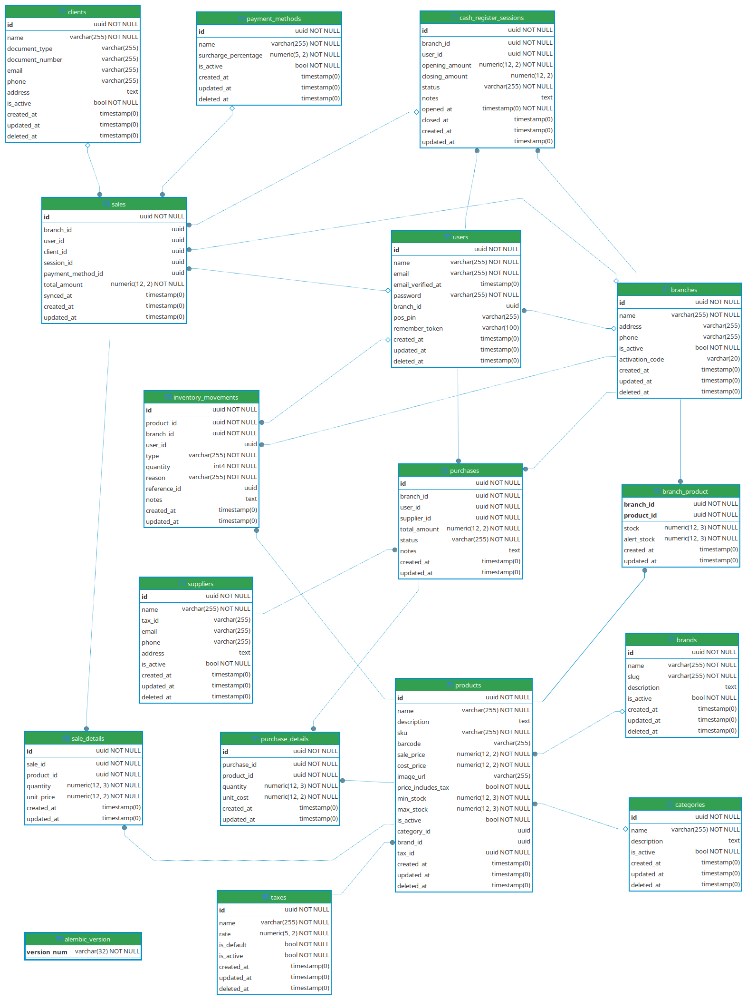

# 🎓 Trabajo final - Bases de datos Avanzadas

## 👥 Integrantes del grupo 7
- **Agustín Giorlando** 
- **Agustín Lara**
- **Almeira Branko**
- **Federico Sosa**
- **Lisandro Toledo**

## 🛒 Sistema de Ventas (Punto de Venta)

Aplicación de escritorio para la gestión de ventas, inventario y sucursales. Trabajo práctico final para la materia de Base de Datos Avanzada.

## 🏗️ Arquitectura

*   **Lenguaje:** Python 3.x
*   **Interfaz Gráfica:** CustomTkinter
*   **Motor de Base de Datos:** PostgreSQL 17 (vía Docker)
*   **ORM:** SQLAlchemy (modo sincrónico)
*   **Migraciones:** Alembic

## ⚙️ Requisitos Previos

Para ejecutar el proyecto en tu máquina local vas a necesitar:
1. Tener instalado [Python 3.10+](https://www.python.org/downloads/)
2. Tener instalado [Docker](https://www.docker.com/products/docker-desktop/) y Docker Compose
3. Git

---

## 🚀 Guía de Instalación Rápida

### 1️⃣ Clonar el repositorio y preparar variables de entorno
Descargá el proyecto y creá tu archivo `.env` a partir de la plantilla:

```bash
git clone https://github.com/UTN-BDA-2026/Repositorio_grupo_7.git
cd Repositorio_grupo_7
cp .env.example .env
```
*(Asegurate de revisar el `.env` y poner contraseñas seguras si es necesario).*

### 2️⃣ Levantar la base de datos (Docker)
Asegurate de tener Docker corriendo en tu sistema operativo, y luego ejecutá:

```bash
docker compose up -d
```
Esto descargará la imagen de PostgreSQL y la dejará corriendo en el puerto `5438`.

### 3️⃣ Crear el Entorno Virtual de Python
Es altamente recomendable usar un entorno virtual para no ensuciar tu sistema:

**En Windows:**
```bash
python -m venv venv
.\venv\Scripts\activate
```

**En Linux / Mac:**
```bash
python3 -m venv venv
source venv/bin/activate
```

### 4️⃣ Instalar las dependencias
Con el entorno virtual activado, instalá las librerías necesarias:

```bash
pip install -r requirements.txt
```

### 5️⃣ Aplicar migraciones de la Base de Datos
Para crear las tablas en tu PostgreSQL local a partir de los modelos de SQLAlchemy, ejecutá:

```bash
alembic upgrade head
```

---

## 🏃 Ejecutar la aplicación

Una vez completados todos los pasos anteriores, podés iniciar el sistema con:

```bash
python main.py
```

## 📚 Documentación adicional

Para entender las decisiones de diseño técnico, la estructura de la base de datos y cómo cumplimos con los puntos requeridos en los enunciados del práctico, revisá el documento [Lineamientos del Proyecto](docs/lineamientos.md).

También puedes consultar el Diagrama de Entidad-Relación de la base de datos (haz clic en la imagen para verla en tamaño completo):

<p align="center">
  <a href="docs/diagrama_bda_tp_fnal.png" target="_blank">
    
  </a>
</p>

## 🎯 Cobertura de Requisitos de la materia (Borrador de progreso)

*Nota: Esta sección es temporal. Se explica cómo la arquitectura actual cumple con los requisitos del TP.*

El desarrollo cubrirá al menos 4 de los puntos obligatorios exigidos:

### 1. ORM y/o Sin ORM (✅ Listo)
Se implementó toda la capa de acceso a datos utilizando **SQLAlchemy (ORM)** mediante un Patrón Repositorio Genérico. es decir que las tareas comunes (como crear, leer, editar o borrar registros) se manejan utilizando objetos nativos de Python, logrando un código limpio y evitando escribir consultas SQL repetitivas.

### 2. Seguridad (✅ Listo)
La seguridad del sistema está cubierta desde la base estructural:
*   **Archivos `.env`:** Ninguna contraseña ni dato sensible está guardado en el código fuente. Todo se lee a través de variables de entorno locales.
*   **Prevención de Inyección SQL:** Gracias al uso de SQLAlchemy, todas las entradas de datos que haga el usuario son filtradas y sanitizadas.

### 3. Índices Estratégicos (⏳ Pendiente)
Además de las Claves Primarias por defecto, se agregarán índices en la base de datos para asegurar el máximo rendimiento. Se colocarán estratégicamente en aquellas columnas que la interfaz utilizará para búsquedas frecuentes (ej: DNI en Clientes o el SKU en Productos).

### 4. Backup & Restore (⏳ Pendiente)
Para facilitar la administración del sistema, se integrará una función de copias de seguridad directamente en la Interfaz Gráfica. El usuario administrador podrá generar un volcado de la base de datos con un solo clic.

### 5. Transacciones Avanzadas (⏳ Pendiente)
Para los procesos críticos, se optará por el enfoque "Sin ORM". Se ejecutará código SQL nativo para poder controlar manualmente la Transacción y garantizar que el registro del ticket y el descuento de stock ocurran como un bloque atómico (usando `ROLLBACK` ante fallas).

### 6. Arquitectura de Interfaz Monolítica (✅ Decidido)
Para la presentación del sistema, se optó por una aplicación de escritorio utilizando **CustomTkinter**. Al integrar directamente los servicios de la base de datos con la interfaz visual, nos ahorramos la necesidad de crear y mantener APIs complejas (como FastAPI).

---

<p align="center">
<a href="https://www.frsr.utn.edu.ar/" title="UTN - Sede San Rafael">
<image src="https://www.frsr.utn.edu.ar/wp-content/uploads/2025/03/utn_icon_05.png" width="200"/>
</a>
<p>